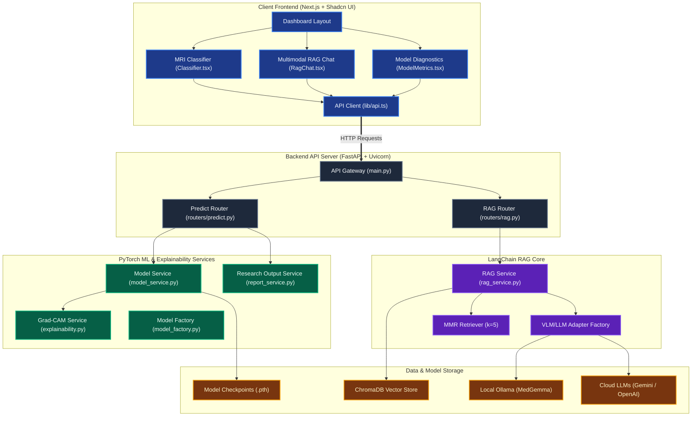

# AI NeuroOnco — 2D MRI Research Classification & Literature RAG

🧠 **Leakage-aware public-data research platform for brain MRI classification and literature retrieval**

AI NeuroOnco is a research-only full-stack prototype for four source-dataset labels (glioma, meningioma, pituitary tumour, and no tumour), Grad-CAM experiments, and row-level literature retrieval. It currently supports single 2D images, not MRI volumes. Completed internal results are reported only as source-dataset proof-of-concept evidence; no clinical, diagnostic, patient-level, or external-generalization claim is made.

> **Safety and scope:** Outputs are non-diagnostic. The four labels are not WHO CNS integrated diagnoses. Inference fails closed when no trained checkpoint is present.

---

## 🏗️ System Architecture

The platform consists of a decoupled, high-performance architecture containing a Next.js client, a FastAPI microservice, a PyTorch computer vision framework, and a LangChain RAG pipeline:



---

## 🌟 Key Features

### 1. Computer Vision & Explainability (PyTorch)
* **Prespecified model comparison**: EfficientNet-B0 transfer learning versus a lightweight custom CNN, with measured results written only from completed-run artifacts.
* **Leakage-resistant data preparation**: Preserves official test data and forms transitive split groups from patient IDs, exact hashes, and perceptual hashes.
* **Single-image DICOM ingestion**: Reads and window-normalizes a 2D DICOM image. DICOM series and volumetric inference are not supported.
* **Calibration analysis**: Validation-only temperature scaling, grouped bootstrap confidence intervals, MCC, PR-AUC, ECE, Brier score, and risk–coverage. Scaling worsened locked-test calibration for both evaluated models, so probabilities are not claimed to be calibrated.
* **Grad-CAM research checks**: Repeatability, parameter-randomization sensitivity, localization IoU, and pointing-game evaluation scaffolding.
* **Research PDF summaries**: Clearly labelled non-diagnostic output with no diagnosis codes or final-report status.

### 2. Grounded Multimodal RAG Chatbot (LangChain + ChromaDB)
* **Automatic Database Hydration**: On backend startup, the system prefers the normalized companion Paper Index (falling back to the source tracker) when the database is empty or lacks current row-level provenance.
* **Row-level Excel provenance**: Each tracker row retains record ID, title, year, DOI/link, sheet, row number, corpus version, and deterministic chunk ID.
* **Multimodal research input**: Researchers can attach an image to a literature query. Image-conditioned answers remain experimental, non-diagnostic, and must be assessed separately from retrieval quality.
* **Retrieval benchmarking**: A held-out JSONL template and CLI report recall@k, precision@k, hit@k and reciprocal rank without requiring an LLM.

### 3. Model Diagnostics Dashboard (Shadcn UI)
* **Visual Evaluation Metrics**: Renders generated statistics only after a trained checkpoint and evaluation artifacts exist.
* **Hardware & Hyperparameters**: Displays training configurations such as execution hardware (CUDA / MPS / CPU), batch sizes, base learning rates, and target epoch limits.

---

## 📂 Project Directory Structure

```text
AI_NeuroOnco/
├── api/                         # FastAPI Backend Application
│   ├── main.py                  # API Entry point & CORS configuration
│   ├── routers/                 # API Route controllers
│   │   ├── predict.py           # ML inference, metrics, and report routes
│   │   └── rag.py               # Chat ingestion and chat completion routes
│   ├── services/                # Business services
│   │   ├── model_service.py     # Image loading, DICOM scaling, inference
│   │   ├── report_service.py    # Non-diagnostic research PDF summary
│   │   └── rag_service.py       # LangChain multi-LLM setup & document indexing
│   ├── requirements.txt         # Backend dependencies
│   └── venv/                    # Local Python virtual environment
├── web/                         # Next.js Frontend Client App
│   ├── src/app/                 # Layouts and global stylesheets (Tailwind CSS)
│   ├── src/components/          # React components
│   │   ├── Classifier.tsx       # MRI scan classification dashboard
│   │   ├── RagChat.tsx          # Multimodal chatbot with grounding citations
│   │   ├── ModelMetrics.tsx     # Training performance metrics dashboard
│   │   └── ui/                  # Shadcn UI primitives (Card, Select, Button, etc.)
│   └── src/lib/api.ts           # Centralized API fetch wrapper and types
├── src/                         # PyTorch Deep Learning Source Code
│   ├── models/                  # CNN & Transfer learning architectures
│   ├── config.py                # Hyperparameters, pixel metrics, and path variables
│   ├── dataset.py               # PyTorch dataset transforms (rotation, flip, eraser)
│   ├── explainability.py        # Hook-based Grad-CAM heatmap overlays
│   ├── train.py                 # Mixed precision (AMP) train loop with TensorBoard
│   ├── evaluate.py              # Publication-quality ROC & Confusion matrix plots
│   └── utils.py                 # Random seeding and utility helpers
├── data/                        # Local dataset cache (ignored from git)
├── outputs/                     # Generated model weights, figures, and tensorboards
├── scripts/                     # Utility scripts (downloading Kaggle datasets)
├── research/                    # Frozen protocol, manuscript shell, checklist, benchmarks
├── configs/                     # Prespecified experiment configuration
├── tests/                       # Data-integrity, metrics, inference-safety and RAG tests
├── setup.sh                     # Automated environment configuration script
├── start_api.sh                 # Backend startup launch script
└── start_web.sh                 # Frontend startup launch script
```

The paper-facing audit trail is in [`research/LITERATURE_SYNTHESIS.md`](research/LITERATURE_SYNTHESIS.md), [`research/FULL_TEXT_EXTRACTION.md`](research/FULL_TEXT_EXTRACTION.md), [`research/TRACK1_TRACK2_HANDOFF.md`](research/TRACK1_TRACK2_HANDOFF.md), [`research/RESULTS_SUMMARY.md`](research/RESULTS_SUMMARY.md), and [`research/MANUSCRIPT_DRAFT.md`](research/MANUSCRIPT_DRAFT.md). The maintained companion index is `outputs/literature_audit_2026-07-15/AI_NeuroOnco_Literature_Audit_and_Index.xlsx`; the supplied source tracker is preserved unchanged. The generated cohort quality report is in `outputs/data_quality/`, paired model evidence is in `outputs/model_comparison/`, and machine-readable submission blockers are in `outputs/research_readiness.json`.

---

## 🚀 Installation & Running Guide

Use Python 3.10 or newer; Python 3.12 is preferred for current dependency support.

### Step 1: Initialize the Workspace
Execute the automated setup script from the root directory to create the virtual environment, install python packages, construct data folders, and install npm modules:
```bash
chmod +x setup.sh start_api.sh start_web.sh
./setup.sh
```

### Step 2: Set Up Local LLMs (MedGemma)
For local inference without sending prompts to a cloud model provider, install Ollama and pull Google's `medgemma` model. Local deployment still requires normal institutional security and data-governance controls:
```bash
# Install Ollama (macOS CLI)
curl -fsSL https://ollama.com/install.sh | sh

# Pull the medical foundation model
ollama pull medgemma:latest
```

### Step 3: Run the Application
Launch both backend and frontend servers in separate terminal sessions:
* **Backend Terminal:**
  ```bash
  ./start_api.sh
  ```
  *(During startup, the system will output `Ingesting default Literature Tracker` if starting with a clean DB).*

* **Frontend Terminal:**
  ```bash
  ./start_web.sh
  ```

Open **`http://localhost:3000`** in your browser to access the complete application!

## 🔬 Research execution

Read [`research/PROTOCOL.md`](research/PROTOCOL.md) before inspecting model results. The reproducible sequence is:

```bash
python scripts/check_research_readiness.py
python scripts/download_data.py
python -m src.train --model efficientnet
python -m src.train --model custom_cnn
python scripts/evaluate_external.py --help
python scripts/evaluate_xai.py --help
python scripts/evaluate_rag.py --k 5
python -m unittest discover -s tests -v
```

Detailed commands and artifact expectations are in [`research/EXPERIMENT_PLAN.md`](research/EXPERIMENT_PLAN.md). The evidence-constrained draft in [`research/MANUSCRIPT_DRAFT.md`](research/MANUSCRIPT_DRAFT.md) reports completed artifacts and explicitly marks endpoints that remain unevaluated.

---

## ⚙️ Environment Variables

Copy `api/.env.example` to `api/.env` and configure credentials if using cloud LLM providers:

```env
# Google Gemini API
GOOGLE_API_KEY=your_api_key_here

# To target complex reasoning models (defaults to gemini-2.0-flash):
# GEMINI_MODEL=gemini-1.5-pro

# OpenAI API (Optional)
OPENAI_API_KEY=your_api_key_here

# Ollama Host URL (defaults to http://localhost:11434)
# OLLAMA_BASE_URL=http://localhost:11434
```
