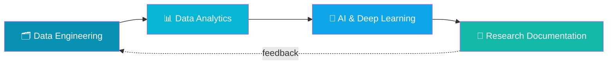
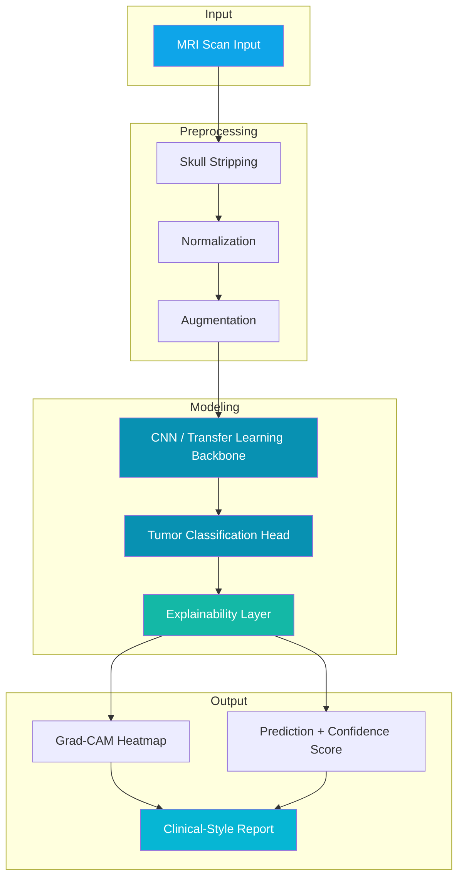
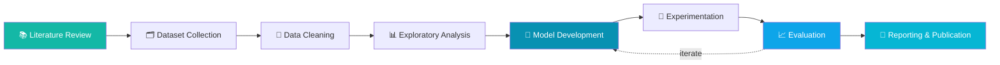
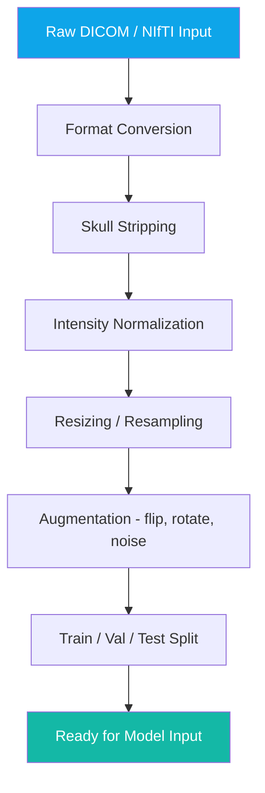
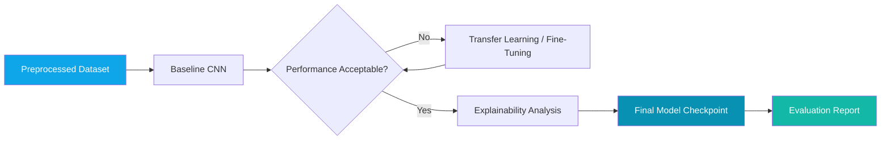
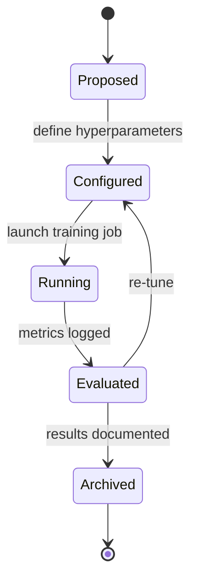
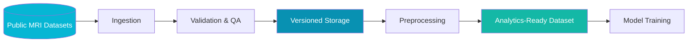
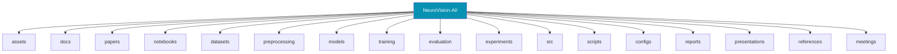
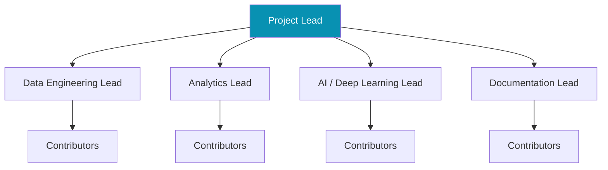
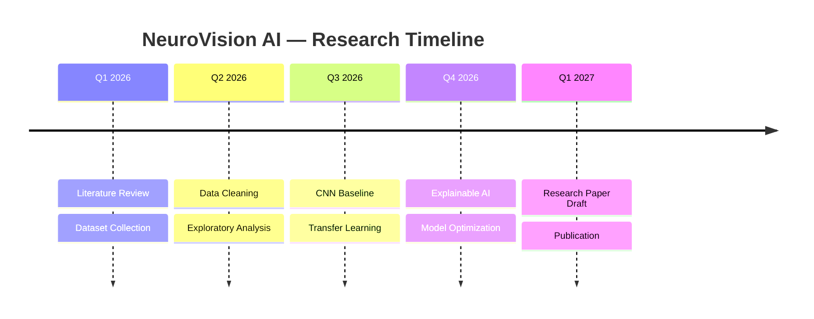

<div align="center">

<!-- ============================================================ -->
<!--  HERO SECTION — edit tagline / title text below as needed     -->
<!-- ============================================================ -->


<br/>

# 🧠 NeuroVision AI

### *AI-Assisted Brain Tumor Detection through Medical Imaging*

<br/>

<!-- Animated typing banner — replace &lines= values to change the cycling text -->
<a href="#">
  
</a>

<br/><br/>

> A reproducible, transparent, and collaborative research framework for early-stage brain tumor detection using deep learning on MRI scans.

<br/>

<!-- ============================================================ -->
<!--  BADGES — update version / status badges as the project grows -->
<!-- ============================================================ -->


</div>

<br/>

<!-- ============================================================ -->
<!--  NAVIGATION                                                   -->
<!-- ============================================================ -->

<div align="center">

**[Overview](#-overview)** •
**[Objectives](#-objectives)** •
**[Architecture](#-system-architecture)** •
**[Research Pipeline](#-research-pipeline)** •
**[Repository Structure](#-repository-structure)** •
**[Timeline](#-research-timeline)** •
**[Experiments](#-experiment-lifecycle)** •
**[Datasets](#-dataset-pipeline)** •
**[Dashboard](#-research-dashboard)** •
**[Roadmap](#-roadmap)** •
**[Team](#-research-team)** •
**[Contributing](#-contributing)** •
**[Citation](#-citation)** •
**[License](#-license)**

</div>

<br/>

---

## 🔎 Overview

<table>
<tr>
<td width="60%">

**NeuroVision AI** is a research hub dedicated to building a reproducible, end-to-end deep learning framework for early detection of brain tumors from MRI imaging.

The repository unifies **research documentation, datasets, experiments, and source code** into a single collaborative workspace — organized the way a modern AI research lab operates.

This is a **living research project**. Findings, models, and documentation are updated continuously as the work progresses.

</td>
<td width="40%">

```text
🎯 Mission
Advance early, reliable brain
tumor detection through
transparent, reproducible AI
research — in service of
better clinical outcomes.
```

</td>
</tr>
</table>

<br/>

## 🎯 Objectives

<table>
<tr>
<td align="center" width="25%">

### 🩻
**Detection Accuracy**
Build CNN / transfer-learning models that reliably localize and classify tumor regions in MRI scans.

</td>
<td align="center" width="25%">

### 🔁
**Reproducibility**
Every experiment is versioned, documented, and re-runnable from raw data to result.

</td>
<td align="center" width="25%">

### 🔍
**Explainability**
Integrate interpretability methods (Grad-CAM, SHAP) so predictions remain clinically trustworthy.

</td>
<td align="center" width="25%">

### 🤝
**Open Collaboration**
Structured for contributors across data engineering, analytics, ML, and research writing.

</td>
</tr>
</table>

<br/>

---

## 🧩 Research Divisions

<table>
<tr>
<td width="50%" valign="top">

### 🗂 Data Engineering

Builds and maintains the data backbone of the project.

**Responsibilities**
- MRI dataset ingestion & versioning
- Preprocessing pipelines (skull-stripping, normalization, augmentation)
- Data quality checks & storage management

</td>
<td width="50%" valign="top">

### 📊 Data Analytics

Turns raw imaging data into research-ready insight.

**Responsibilities**
- Exploratory data analysis (EDA)
- Class distribution & imaging statistics
- Visualization of scan cohorts and metadata

</td>
</tr>
<tr>
<td width="50%" valign="top">

### 🤖 AI & Deep Learning

Designs, trains, and evaluates detection models.

**Responsibilities**
- CNN / transfer-learning architectures
- Training, validation, hyperparameter tuning
- Explainability & performance benchmarking

</td>
<td width="50%" valign="top">

### 📝 Research Documentation

Keeps the research transparent and citable.

**Responsibilities**
- Literature reviews & meeting notes
- Progress reports & manuscript drafts
- Reproducibility documentation

</td>
</tr>
</table>

<br/>



<br/>

---

## 🏗 System Architecture



<br/>

---

## 🔬 Research Pipeline



<details>
<summary><strong>🩻 MRI Processing Pipeline (click to expand)</strong></summary>



</details>

<details>
<summary><strong>🤖 Model Training Flow (click to expand)</strong></summary>



</details>

<details>
<summary><strong>🧪 Experiment Lifecycle (click to expand)</strong></summary>



</details>

<br/>

---

## 📦 Dataset Pipeline



> 📌 **Note:** Dataset sources, licenses, and access instructions are documented in [`datasets/README.md`](./datasets/README.md).

<br/>

---

## 🗂 Repository Structure



<details>
<summary><strong>📁 Full folder reference (click to expand)</strong></summary>

| Folder | Purpose |
|---|---|
| `assets/` | Images, diagrams, and static visual assets used across the repo |
| `docs/` | General project documentation and guides |
| `papers/` | Reference papers and internal research manuscripts |
| `notebooks/` | Exploratory Jupyter notebooks (EDA, prototyping) |
| `datasets/` | Dataset metadata, licenses, and access scripts (raw data not committed) |
| `preprocessing/` | Scripts for cleaning, normalizing, and augmenting MRI data |
| `models/` | Model architectures and saved checkpoints |
| `training/` | Training scripts and configuration runners |
| `evaluation/` | Evaluation scripts, metrics, and result logs |
| `experiments/` | Logged experiment configs, outputs, and comparisons |
| `src/` | Core reusable source code / library modules |
| `scripts/` | Utility and automation scripts |
| `configs/` | YAML/JSON configuration files for experiments and pipelines |
| `reports/` | Progress reports and status summaries |
| `presentations/` | Slide decks for internal and external presentations |
| `references/` | Citation libraries and literature references |
| `meetings/` | Meeting notes and action items |

</details>

<br/>

---

## 👥 Team Structure



<br/>

---

## 📅 Research Timeline



<br/>

---

## 📊 Research Dashboard

<!-- Update the values in this table as the project progresses -->

<div align="center">

| Metric | Status |
|---|---|
| ✅ **Current Phase** | Data Preprocessing & EDA |
| 📅 **Timeline** | Q1 2026 – Q1 2027 |
| 📈 **Overall Progress** |  |
| 📄 **Papers Reviewed** | 18 |
| 📚 **Datasets Collected** | 3 |
| 🧪 **Experiments Completed** | 5 |
| 🤖 **Models Tested** | 2 (Baseline CNN, ResNet-Transfer) |
| 📊 **Current Best Accuracy** | 87.4% *(validation set)* |
| 🔬 **Active Research Track** | Transfer Learning Fine-Tuning |

</div>

<br/>

---

## 🛣 Roadmap

<!-- Toggle [ ] -> [x] as milestones are completed -->

- [x] 📚 Literature Review
- [x] 🗂 Dataset Collection
- [x] 🧹 Data Cleaning
- [x] 📊 MRI Exploratory Analysis
- [ ] 🧠 CNN Baseline
- [ ] 🔁 Transfer Learning
- [ ] 🔍 Explainable AI
- [ ] ⚙️ Model Optimization
- [ ] 📝 Research Paper
- [ ] 🚀 Publication


<br/>

---

## 🧑‍🔬 Research Team

<div align="center">
<table>
<tr>
<td align="center" width="20%">
<br/>
<b>Project Lead</b><br/>
<sub>Name Placeholder</sub><br/>
<a href="#">GitHub</a>
</td>
<td align="center" width="20%">
<br/>
<b>Data Engineering Lead</b><br/>
<sub>Name Placeholder</sub><br/>
<a href="#">GitHub</a>
</td>
<td align="center" width="20%">
<br/>
<b>Analytics Lead</b><br/>
<sub>Name Placeholder</sub><br/>
<a href="#">GitHub</a>
</td>
<td align="center" width="20%">
<br/>
<b>AI Lead</b><br/>
<sub>Name Placeholder</sub><br/>
<a href="#">GitHub</a>
</td>
<td align="center" width="20%">
<br/>
<b>Documentation Lead</b><br/>
<sub>Name Placeholder</sub><br/>
<a href="#">GitHub</a>
</td>
</tr>
</table>
</div>

<br/>

**Contributors**

<a href="#">

</a>

<br/><br/>

---

## 💬 Research Philosophy

<div align="center">

> *"Advancing healthcare through responsible artificial intelligence, rigorous research, and interdisciplinary collaboration."*

</div>

<br/>

---

## 🤝 Contributing

We welcome contributions across all four research divisions.

1. Fork the repository
2. Create a feature branch (`git checkout -b feature/your-feature`)
3. Commit your changes with clear messages
4. Open a Pull Request describing the research or engineering change

Please review `docs/CONTRIBUTING.md` *(placeholder)* before submitting.

<br/>

---

## 📖 Citation

If you use this work in your research, please cite:

```bibtex
@misc{neurovision2026,
  title        = {NeuroVision AI: An AI-Assisted Framework for Brain Tumor Detection in MRI},
  author       = {NeuroVision Research Team},
  year         = {2026},
  howpublished = {\url{https://github.com/your-org/neurovision-ai}},
  note         = {Research repository}
}
```

<br/>

---

## 📜 License

Distributed under the **MIT License**. See `LICENSE` for details.

> ⚠️ **Research Disclaimer:** NeuroVision AI is a research project and is **not** a certified medical diagnostic tool. It is not intended for clinical use without appropriate regulatory approval and validation.

<br/>

---

<div align="center">

### 📈 Repository Statistics


<br/>

**📧 Contact:** research@neurovision.ai&nbsp;&nbsp;|&nbsp;&nbsp;**🌐 Lab Site:** *coming soon*

<br/>


*Built with 🧠 by the NeuroVision Research Team*

</div>
